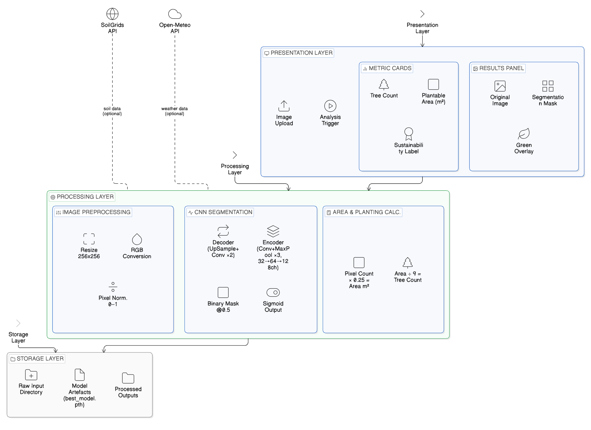
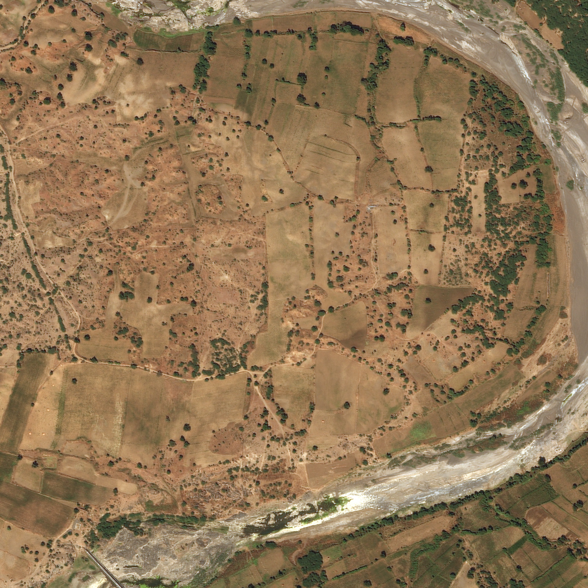
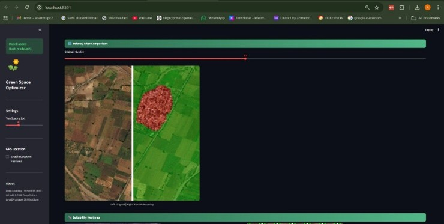
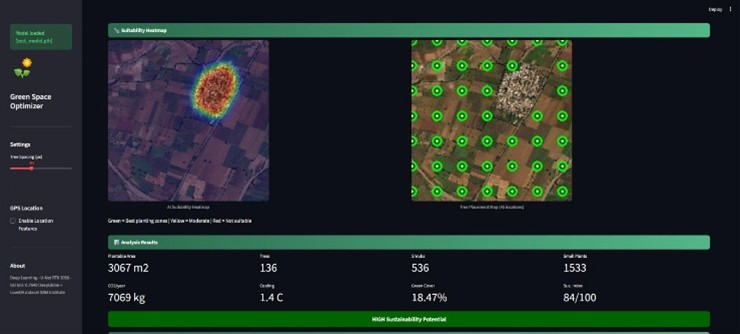
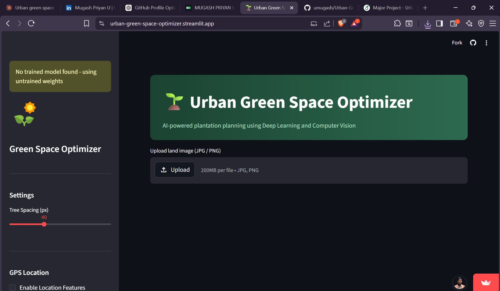
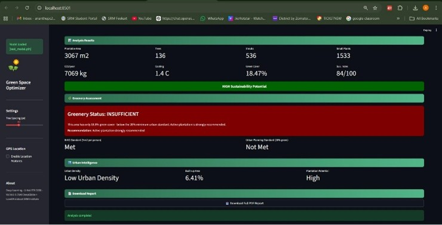

<h1 align="center">🌱 Urban Green Space Optimizer</h1>

<h3 align="center">
AI-powered sustainable plantation planning using U-Net segmentation & environmental analysis
</h3>

<p align="center">


</p>

<p align="center">

🚀 Live Demo:

https://urban-green-space-optimizer.streamlit.app/

</p>

---

# 🌍 Project Overview

Urban Green Space Optimizer is an AI-based decision support system designed to identify **plantable urban zones** from satellite or aerial imagery and generate sustainability metrics for environmentally responsible plantation planning.

The system combines:

✔ Deep Learning (U-Net segmentation)  
✔ Computer Vision  
✔ Spatial estimation  
✔ Environmental intelligence  
✔ Sustainability analysis  

Outputs support **municipal planning**, **environmental researchers**, and **urban sustainability initiatives**.

---

# ✨ Key Features

✅ Detect plantable areas using U-Net semantic segmentation

✅ Generate segmentation masks & overlays

✅ Estimate:

- Plantable area (m²)
- Trees
- Shrubs
- Small plants
- CO₂ sequestration
- Cooling effect
- Sustainability Index

✅ WHO green-space compliance checks

✅ Urban intelligence classification

✅ Downloadable PDF reports

✅ Interactive Streamlit web interface

---

# 🏗 System Architecture

<p align="center">



</p>

Architecture follows:

User Upload → Preprocessing → U-Net Segmentation → Area Estimation → Sustainability Metrics → Report Generation


---

# 🧠 Model Details

Model:

```text
U-Net (CNN-based Semantic Segmentation)
```

Training Dataset:

```text
DeepGlobe + LoveDA
```

Total Samples:

```text
2279 images
```

Train / Validation / Test:

```text
1709 / 341 / 229
```

Epochs:

```text
50
```

Framework:

```text
PyTorch
```

---

# 📊 Performance Metrics

| Metric | Score |
|--------|--------|
| Validation IoU | 0.7640 |
| Test IoU | 0.6286 |
| Dice Score | 0.7254 |
| Precision | 0.7663 |
| Recall | 0.7370 |

Model achieved stable convergence over 50 epochs.

---

# 🖼 Screenshots

## Input Image



---

## Segmentation Output



---

## AI Heatmap + Tree Placement



---

## Sustainability Metrics Dashboard



---

## Chatbot + Report Summary



---

*(Create `/images` folder and place screenshots there)*

---

# 🎥 Demo Video

Add project walkthrough GIF/video:

```text
demo/demo.gif
```

or

```text
demo/demo.gif
```

---

# 🚀 Live Deployment

Streamlit App:

https://urban-green-space-optimizer.streamlit.app/

---

# ⚙ Installation

Clone repository:

```bash
git clone https://github.com/umugash/Urban-Green-Space-Optimizer.git
```

Install dependencies:

```bash
pip install -r requirements.txt
```

Run application:

```bash
streamlit run app.py
```

---

# 🛠 Tech Stack

Python • PyTorch • OpenCV • NumPy • Pandas • Streamlit • HTML/CSS

---

# 📄 Research Paper Status

📌 Research paper completed

⏳ Waiting for conference publication

This work contributes toward:

SDG 11 → Sustainable Cities

SDG 13 → Climate Action

SDG 15 → Life on Land

---

# 🔮 Future Work

- Google Earth Engine integration
- Multi-class segmentation
- ISRO/Bhuvan datasets
- Temporal change detection
- IoT soil sensors
- Real-time environmental monitoring

---

# 👥 Authors

**Mugash Priyan U**

**Ananthanarayana M**

Guided by:

**Dr. C. Tamizhselvan**

SRM Institute of Science & Technology

---

# ⭐ If you found this project useful

Give this repository a star ⭐
